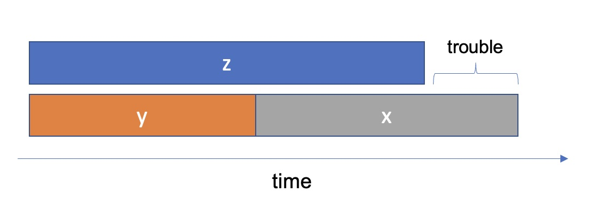
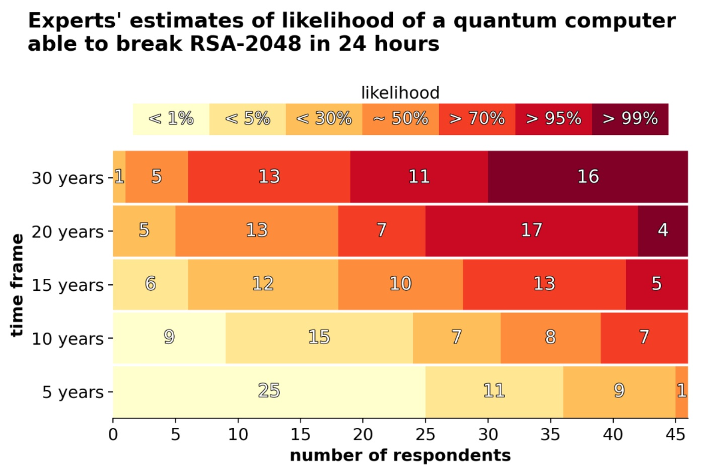

Quantum computers are no longer an abstract idea as they were when Peter Shor developed his efficient quantum algorithms for discrete logarithms and factoring [[S94]](https://ieeexplore.ieee.org/document/365700) in 1994. And while there is still a lot of progress to be made until the quantum computers developed by IBM, Google, and the likes are practically useful. We should, nevertheless, consider the implications of large-scale quantum computers while we still have time to react. Like Peter Shor developed his quantum algorithms before physicists at Oxford University built the first 2-qubit computer in 1998, we should have our strategy for coping with large-scale quantum computers before they pose an actual threat.

One of the most frequently asked questions about quantum computers is "How big is the threat to classical cryptography posed by quantum computers?". Unless an unknown player secretly developed a quantum computer far ahead of the R&D departments of billion-dollar companies such as Google, the answer is unsurprising that there is *currently* no threat at all. However, if we look into the future, things aren't as clear-cut.

$x$: time that products and data must remain secure  
$y$: time it takes to migrate to post-quantum cryptography  
$z$: time it takes until cryptographically-relevant quantum computers will be available  

In his theorem [[M15]](https://csrc.nist.gov/csrc/media/events/workshop-on-cybersecurity-in-a-post-quantum-world/documents/presentations/session8-mosca-michele.pdf) illustrated above, Dr. Michele Mosca pointed out that if $x + y > z$, you should be worried. As cryptographers, we can do nothing to impact $z$; cryptographically-relevant quantum computers will become available, and we can do nothing about it. $x$ is also out of our control for the most part. Some information just has to remain secure for a relatively long time. 
Even if you decide to skip reading the following more technical remainder of this post, know that the only thing we can affect is $y$. Acting now to make our organizations *and* systems crypto-agile is the best thing to  focus on to prepare our systems for quantum adversaries.

> **crypto agility** is not as much about using protocols that support various cryptographic algorithms and key lengths. It is about being able to make and execute the decision to swap protocols or primitives in a live system. This is just as much an organizational challenge as it is an engineering one.

## The Metrics

To quantify the threat posed by quantum algorithms, we need metrics to measure and compare their efficiency. Its requirements in space and time typically define the performance of an algorithm. On traditional hardware, we usually compare the memory consumption and the runtime of algorithms. Terminology aside, not a lot changes when analyzing quantum algorithms. The metrics we use to compare the efficiency and space-time tradeoffs of quantum algorithms are the number of **logical qubits** (space complexity, also referred to as the width of a quantum circuit) and the **gate depth** (time complexity, best measured in the number of sequential Toffoli gates) [[KHJ18]](https://link.springer.com/content/pdf/10.1007/s11128-018-2107-3.pdf) required to execute the algorithm.

### Logical vs. Physical Qubits

Manufacturers of quantum computers like to advertise with big numbers. The latest IBM quantum computer packs 127 qubits [[IBM21]](https://newsroom.ibm.com/2021-11-16-IBM-Unveils-Breakthrough-127-Qubit-Quantum-Processor). They are, however, prone to error and not directly useful in the business of breaking cryptographic algorithms. To satisfy quantum algorithms, we need clean, error-corrected "logical qubits". Many (~13 [[ED+21]](https://arxiv.org/pdf/2009.11482.pdf)) physical qubits can be arranged to encode one logical qubit. A quantum algorithm's requirements in space are measured in logical qubits, while quantum computer marketing material usually refers to physical qubits.

### Gate depth

Quantum gates are the building blocks of quantum algorithms. Taking the total number of gates as the measurement for the time complexity would not be accurate, as each kind of gate introduces a different overhead to the total runtime. The runtime is therefore often expressed by the number of Toffoli gates in the circuit because [[KHJ18]](https://link.springer.com/content/pdf/10.1007/s11128-018-2107-3.pdf)
1. all quantum mechanically allowed computations can be implemented by Toffoli (and single) gates.
2. circuits based on Clifford gates don't provide an advantage over classical computing. Toffoli gates are non-Clifford gates and are essential in delivering a quantum benefit.
3. logical Toffoli gates are expected to be the primary source of time bottlenecks in real applications.

## The Quantum Impact on Classical Cryptography

The quantum algorithms we know today impact different areas of classical (pre-quantum) cryptography differently. As we will see later, asymmetric cryptography based on the factorization of integers (e.g., RSA) or the discrete logarithm problem (e.g., ECDH) is impacted most. Symmetric cryptography (e.g., AES) is also impacted but to a far lesser degree.

### RSA

Shor's algorithm for factoring integers [[S94]](https://ieeexplore.ieee.org/document/365700) is the primary cause of concern for asymmetric cryptography schemes such as RSA [[RSA78]](https://dl.acm.org/doi/10.1145/359340.359342). The security of RSA is based on the fact that it is infeasible to infer the private key from the public key. The public key contains the modulus $n$ and the exponent $e$. Factoring the prime factors ($p$ and $q$) of $n$ - which is not computationally feasible on classical hardware - allows for a full recreation of the private key $d$. 
The following table lists the space and time requirements to break different key lengths (security levels) of RSA.

> Note that the T-Depth in the table below is merely an estimate as no exact numbers are provided in the paper quoted below. The estimate is provided based on the given order of the total gate count $O(n^3 log n)$

| **Algorithm** | **Security Strength** | **# qubits** | **T-Depth (roughly!)**  |
|---------------|-----------------------|--------------|-------------------------|
| RSA-2048      | $112$                 | $4096$       | $8.58 * 10^9$           |
| RSA-3072      | $128$                 | $6144$       | $6.87 * 10^{10}$        |
| RSA-15360     | $256$                 | $30720$      | $3.62 * 10^{12}$        |

> Source: [[HRS17]](https://arxiv.org/pdf/1611.07995.pdf)

### ECC

An elliptic curve private key is a random number in the range of $1 .. n-1$, where $n$ is the order of the group of point $G$. The public key $Q$ is a point defined as $Q = G*k$. The elliptic curve discrete logarithm problem (ECDLP [[HL15]](http://koclab.cs.ucsb.edu/teaching/ecc/project/2015Projects/Haakegaard+Lang.pdf)) is the computationally hard problem of determining $k$ given the points $Q$ and $G$. Using Shor's discrete logarithm quantum algorithm [[S94]](https://ieeexplore.ieee.org/document/365700), the ECDLP becomes computationally feasible under the requirements listed in the table below.

> Note that the requirements for breaking RSA keys of equivalent security strength to ECC keys are roughly equal in time but more complex in space.

| **Algorithm** | **Security Strength** | **# qubits** | **T-Depth**      |
|---------------|-----------------------|--------------|------------------|
| ECC-256       | $128$                 | $2330$       | $1.16 * 10^{11}$ |
| ECC-384       | $192$                 | $3484$       | $4.15 * 10^{11}$ |
| ECC-521       | $256$                 | $4719$       | $1.05 * 10^{12}$ |

> Source: [[RN+17]](https://arxiv.org/pdf/1706.06752v2.pdf)

### AES

Grover's algorithm [[G97]](https://link.aps.org/doi/10.1103/PhysRevLett.79.4709) can be used in known-plaintext attacks [[JN+19]](https://eprint.iacr.org/2019/1146.pdf) that take a reversible quantum implementation of the AES [[NIST2001]](https://csrc.nist.gov/csrc/media/publications/fips/197/final/documents/fips-197.pdf) cipher as well as some plaintext/ciphertext pairs and will search for the corresponding key. Multiple (2 or 3) plaintext/ciphertext pairs are required to ensure Grover finds the correct key. All requirements to break AES at different security levels are listed below.

| **Algorithm** | **Security Strength** | **# qubits** | **T-Depth**      | **# PT/CT pairs** |
|---------------|-----------------------|--------------|------------------|-------------------|
| AES-128       | $128$                 | $3329$       | $1.74 * 10^{21}$ | $2$               |
| AES-192       | $192$                 | $3969$       | $7.45 * 10^{30}$ | $2$               |
| AES-256       | $256$                 | $6913$       | $3.37 * 10^{40}$ | $3$               |

> Source: [[JN+19]](https://eprint.iacr.org/2019/1146.pdf)

Various proposals have been made to improve the security of symmetric algorithms against quantum adversaries [[GT12]](https://homes.cs.washington.edu/~tessaro/papers/cascades.pdf), [[BUK19]](https://eprint.iacr.org/2019/1208.pdf), but none of them have been considered for standardization. It appears as if Grover's algorithm cannot be improved upon or parallelized to achieve significantly better results than presented above [[Z08]](https://arxiv.org/pdf/quant-ph/9711070.pdf). There may, however, be entirely different attack vectors against symmetric cryptography outside of Grover's algorithm [[BSS21]](https://arxiv.org/pdf/2110.02836.pdf), [[HHL09]](https://math.berkeley.edu/~linlin/2018Spring_290/HHL09.pdf).

## Estimates by Experts

A more subjective quantification of the quantum threat can be found in the 2021 Quantum Threat Timeline Report from the Global Risk Institute [[MP22]](https://globalriskinstitute.org/download/quantum-threat-timeline-report-2021-full-report/). 46 Experts estimated the likelihood that quantum computers will be able to break RSA-2048 in 24h in different time frames.

> Source: [[MP22]](https://globalriskinstitute.org/download/quantum-threat-timeline-report-2021-full-report/)

The majority of experts questioned estimate a likelihood of 50%, or above that in 15 years from now, a quantum computer will be able to break RSA-2048 in 24 hours.

## Conclusion

On the one hand, it will probably take us years until we see the first quantum computer with a cryptographically relevant number of clean, logical qubits (> 4000). Even once this milestone is reached, it may still be infeasible at first to run quantum algorithms with a depth of trillions of Toffoli gates as required to break RSA or ECDH in a *reasonable* amount of time. 

On the other hand, we have to expect the capabilities of quantum computers to grow at an exponential rate, following a quantum equivalent to Moore's law [[DS13]](https://www.science.org/doi/10.1126/science.1231930). Additionally, we must assume that our most sensitive information communicated today will be stored now and decrypted later - once quantum attacks on current classical cryptography become feasible. We should also consider that it takes certain industries years to develop and adopt new standards. This leaves us with an immediate need for action to protect our data with long-term security requirements [[BSI20]](https://www.bsi.bund.de/SharedDocs/Downloads/DE/BSI/Krypto/Post-Quanten-Kryptografie.pdf?__blob=publicationFile&v=1), [[ANSSI22]](https://www.ssi.gouv.fr/uploads/2021/12/anssi-technical_position_papers-post_quantum_cryptography_transition.pdf).

The key points to remember are:

* Quantum computers will break asymmetric cryptography based on factorization or the discrete logarithm problem in polynomial time.
* Symmetric cryptography is relatively safe against quantum computers. Doubling the key length (e.g., from AES-128 to AES-256) for long-term keys is currently sufficient.
* Delaying the adoption of quantum-secure cryptography is risky due to "harvest now, decrypt later" attacks.
* Standardization of post-quantum cryptography is still ongoing, and the maturity level of the candidates for standardization should not be overestimated [[ANSSI22]](https://www.ssi.gouv.fr/uploads/2021/12/anssi-technical_position_papers-post_quantum_cryptography_transition.pdf).